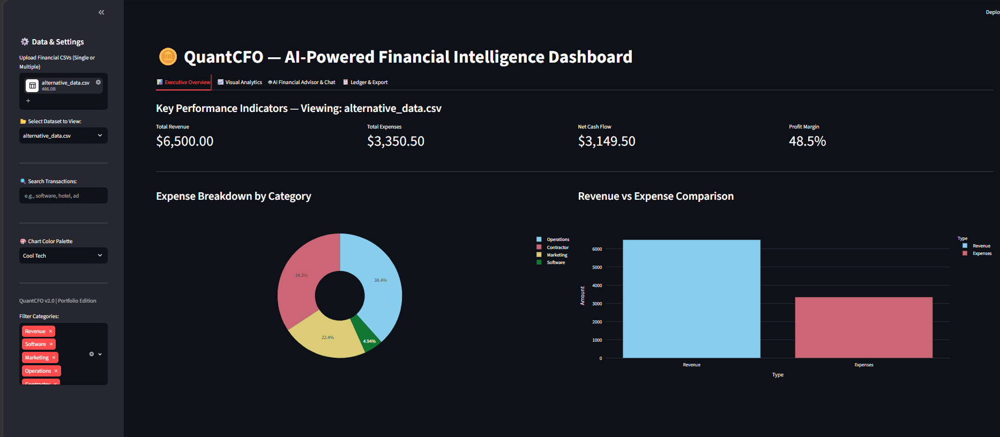
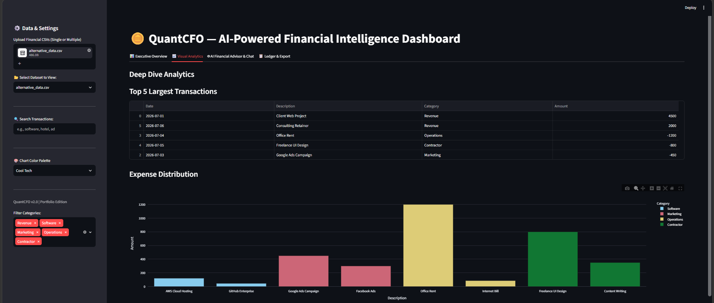
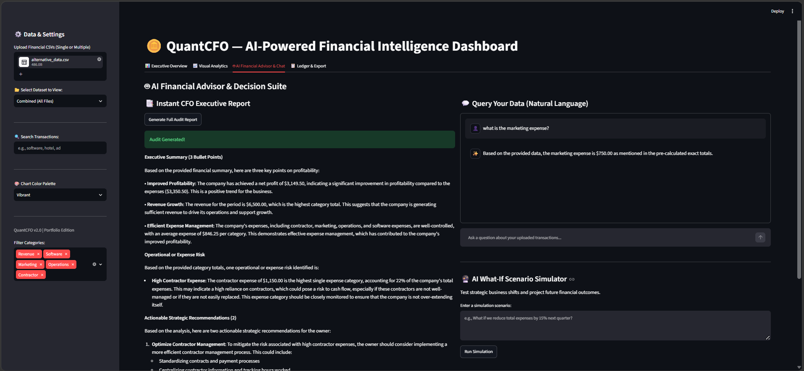
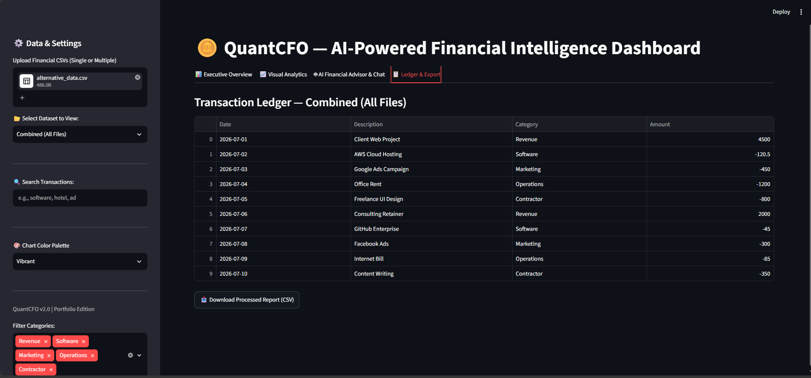

# 🪙 QuantCFO — AI-Powered Financial Intelligence Dashboard


---

## a. Overview & The Real Problem It Solves
**App Name:** QuantCFO  
**What it does:** QuantCFO is a full-stack financial data analytics dashboard that ingests raw, unstructured transaction CSV files and automatically transforms them into an interactive visual ledger. Powered by an integrated artificial intelligence engine, it acts as an automated Chief Financial Officer—auditing accounts, answering natural-language queries, and running predictive budget simulations.

**The Real Problem It Solves:** Small business owners, freelancers, and project student teams frequently struggle with messy, unstandardized financial data exported from various bank accounts. Manually calculating cash flow, categorizing mixed expenses, and forecasting budgets is tedious, error-prone, and time-consuming. QuantCFO solves this by automating the data cleaning (ETL) pipeline, visualizing performance metrics in real-time, and delivering high-level financial consulting without the high cost of a human analyst.

---

## b. Live Deployed URL
🔗 **Access the Live Application Here:** https://quantcfo-sa8ldag6fnnkdgvc3heg6p.streamlit.app/

*(Note: The live deployed version on Streamlit Community Cloud has a platform-enforced hard limit of 200MB for CSV file uploads. When run locally, this limit is extended up to 1GB.)*

---

## c. Comprehensive Features List
* **Smart Schema Adapter (ETL):** Automatically detects and standardizes messy CSV file structures, mapping varied column titles (e.g., `cost`, `price`, `value` $\rightarrow$ `Amount`) without manual user configuration.
* **Real-Time KPI Engine:** Computes Total Revenue, Total Expenses, Net Cash Flow, and Profit Margins dynamically.
* **Interactive Visual Analytics:** Utilizes `Plotly Express` to generate theme-responsive pie charts and bar graphs mapping expense distributions and cash flow comparisons.
* **Global Keyword Search & Filtering:** Instantly filters transactions across categories and keywords.
* **Instant CFO Audit Report:** Generates a 3-bullet executive summary evaluating profitability and highlighting operational risks.
* **Interactive AI Chat Interface:** Features persistent conversation history in the interface, allowing users to query transaction logs using natural language.
* **Predictive "What-If" Scenario Simulator:** Allows users to input strategic shifts (e.g., *"What if we reduce operations expenses by 20%?"*) and uses AI reasoning to estimate the impact on profit and profitability.
* **Clean Ledger & CSV Export:** Provides a fully sortable transaction table with a one-click clean report download button.

---

## d. Project Architecture Flow
```text
CSV Upload
      │
      ▼
Schema Adapter
      │
      ▼
Data Cleaning
      │
      ▼
Financial KPIs
      │
 ┌────┴────────┐
 ▼             ▼
Charts       AI Engine (Pandas pre-calculations + Llama 3.1)
      │
      ▼
Export / UI Rendering
```

## e. The AI Feature & System Instructions
QuantCFO integrates Meta's Llama 3.1 (8b-instant) model via the Groq API to provide AI-powered financial intelligence.

To improve numerical consistency and overcome common Large Language Model limitations regarding math hallucinations, financial summaries and category totals are deterministically computed with Pandas before being injected into the LLM prompt context. This highlights a robust engineering approach combining deterministic computation with AI reasoning.

**Core System Prompt Used for Data Querying & Analysis:**
```text
You are a financial data analyst. Answer the user's question accurately using ONLY the provided data.

CRITICAL MATH INSTRUCTION:
Do NOT add the pre-calculated totals to the individual transactions. They are the exact same data. When asked for totals or comparisons, ONLY use the pre-calculated exact totals provided below.

Pre-calculated Exact Totals:
{category_totals_str}

Raw Transaction Dataset:
{context_data}

User Question: {user_query}
```

## f. Technology Stack & Services Used
- **Frontend & UI Framework:** Streamlit
- **Data Processing & Engineering:** Pandas
- **Data Visualization:** Plotly Express
- **AI Model Provider:** Groq API (Llama-3.1-8b-instant)
- **Hosting / Deployment:** Streamlit Community Cloud

## g. Screenshots of the App in Action
**Executive Overview & Visual Analytics Dashboard:**
*(Displays real-time KPIs, expense distribution breakdown, and revenue vs. expense comparisons)*


**Deep Dive Analytics & Expense Distribution:**
*(Highlights top transactions and categorized cost breakdowns)*


**AI Financial Advisor & Chat Suite (Core Feature):**
*(Shows the instant CFO report, natural language chat, and what-if simulation engine)*


**Transaction Ledger & Data Export:**
*(The standardized table view resulting from the Smart Schema Adapter)*

## h. How to Run the Project Locally
Follow these instructions to set up and run QuantCFO on your local machine:

1. Clone the repository:
```bash
git clone https://github.com/lrwa334/QuantCFO.git
cd QuantCFO
```

2. Install dependencies:
```bash
pip install streamlit pandas plotly groq
```

3. Configure your API Keys (Secure Secrets):
Create a hidden folder named `.streamlit` in the project root directory.
Inside that folder, create a file named `secrets.toml`.
Add your Groq API key:
```toml
GROQ_API_KEY = "your_actual_groq_api_key_here"
```
*(⚠️ Never commit your `secrets.toml` file or API keys to GitHub!)*

4. Run the application:
```bash
streamlit run app.py
```

*Developed independently as an end-to-end AI project submission.*
